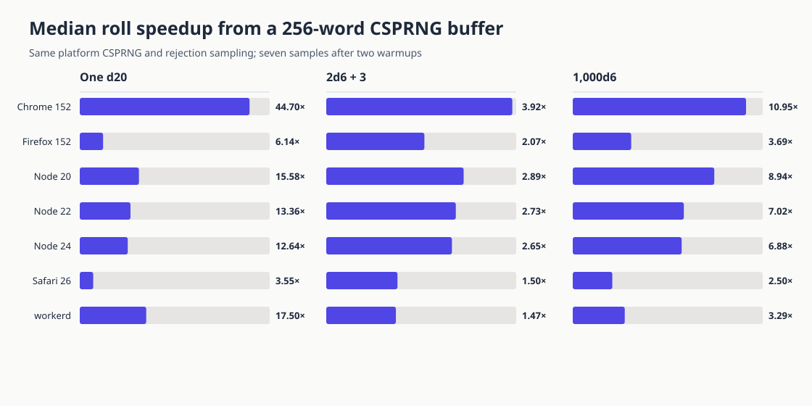

# CSPRNG refill results

Measured 30 August 2026 on an Apple M3 Max running macOS. The browser and Node processes ran
locally on the same machine. workerd 2026-08-01 used compatibility date 2026-08-08.

The benchmark compares the previous one-word `crypto.getRandomValues` call with buffers of 1,
16, 64, 256 and 1,024 uint32 words. Every candidate uses `crypto.getRandomValues`; buffering
changes how many independent words one platform call fills, not where the words come from.

## Selected buffer

A 256-word buffer is the knee of the results. Moving from 256 to 1,024 improves some raw-word
measurements, but has little effect on complete rolls. The smaller buffer adds 1 KiB of module
state and less first-refill work.

The graph and table report median speedup over the one-word baseline. The cold-source
column is the extra time to create a source and read its first word; it is a one-time cost for
the default module source.

| Runtime | Cold-source cost | Raw words | `rollDie(20)` | `roll('2d6+3')` | `roll('1000d6')` |
| --- | ---: | ---: | ---: | ---: | ---: |
| Chrome 152 | +0.23 µs | 84.38× | 44.70× | 3.92× | 10.95× |
| Firefox 152 | +1.55 µs | 39.00× | 6.14× | 2.07× | 3.69× |
| Node 20.20.2 | +0.17 µs | 83.46× | 15.58× | 2.89× | 8.94× |
| Node 22.23.2 | +0.15 µs | 68.14× | 13.36× | 2.73× | 7.02× |
| Node 24.15.0 | +0.18 µs | 66.05× | 12.64× | 2.65× | 6.88× |
| Safari 26.6.2 | +0.55 µs | 15.00× | 3.55× | 1.50× | 2.50× |
| workerd 2026-08-01 | +0.30 µs | 17.50× | 17.50× | 1.47× | 3.29× |

## Method

Each row uses the median of seven samples after two warmups. Raw words and d20 rolls use
200,000 operations per sample. `2d6+3` uses 20,000 rolls, `1000d6` uses 100 rolls, and the
cold-source measurement uses 20,000 newly created sources. A checksum keeps every workload's
result observable.

The raw JSON under [`results/`](./results/) contains every sample and the runtime metadata.
[`README.md`](./README.md) explains how to repeat the runs.

## Limits

These are local microbenchmarks from one machine, not service-level latency measurements.
Browser timers have coarser resolution than Node's timer, so the workloads repeat enough
operations to keep each median above that resolution. Absolute timings should not be compared
between runtimes. The speedup ratios compare candidates inside one process and one workload.
